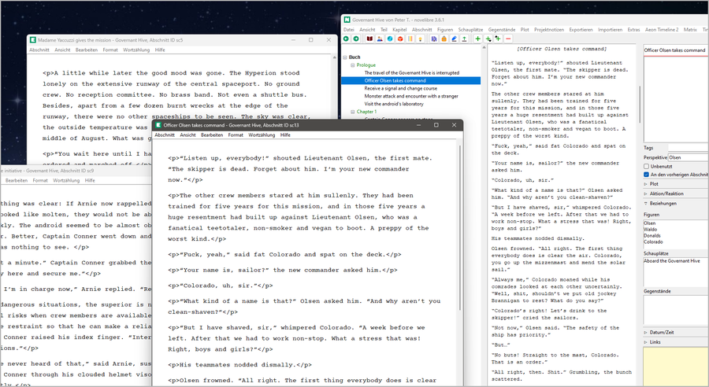

#  nv_editor

The [novelibre](https://github.com/peter88213/novelibre/) Python program helps authors organize novels.  

*nv_editor* is a plugin providing a "plain text" section editor. 

## Features

- A simple text editor box without rich text display and search capability.
- Text is edited at the "XML markup" level. XML tags are displayed as stored in the *novx* file. Most of the formatting tags are similar to those of HTML.
- Multiple section editor windows.
- Word count is displayed and updated either live or on demand.
- The application is ready for internationalization with GNU gettext. A German localization is provided. 
- Editor features:
    - Text selection.
    - Copy/Cut/Paste to/from the clipboard.
    - Undo/Redo.
    - Key shortcuts for bold and italic formatting.
    - Create a new section after the current one.
    - Split the section at the cursor position.
    - Navigation to the next or previous section.
    
**WARNING:** With this text editor, you can mess up your *novelibre* section content by malforming it. 
So if you don't know what "well-formed XML" means, this plugin might not be the right thing for you. 

## Requirements

- [novelibre](https://github.com/peter88213/novelibre/) version 5.30+

## Download and install

### Default: Executable Python zip archive

Download the latest release [nv_editor_v5.6.1.pyz](https://github.com/peter88213/nv_editor/raw/main/dist/nv_editor_v5.6.1.pyz)

- Launch *nv_editor_v5.6.1.pyz* by double-clicking (Windows/Linux desktop),
- or execute `python nv_editor_v5.6.1.pyz` (Windows), resp. `python3 nv_editor_v5.6.1.pyz` (Linux) on the command line.

#### Important

Many web browsers recognize the download as an executable file and offer to open it immediately. 
This starts the installation.

However, depending on your security settings, your browser may 
initially  refuse  to download the executable file. 
In this case, your confirmation or an additional action is required. 
If this is not possible, you have the option of downloading 
the zip file. 

### Alternative: Zip file

The package is also available in zip format: [nv_editor_v5.6.1.zip](https://github.com/peter88213/nv_editor/raw/main/dist/nv_editor_v5.6.1.zip)

- Extract the *nv_editor_v5.6.1* folder from the downloaded zipfile "nv_editor_v5.6.1.zip".
- Move into this new folder and launch *setup.pyw* by double-clicking (Windows/Linux desktop), 
- or execute `python setup.pyw` (Windows), resp. `python3 setup.pyw` (Linux) on the command line.

---

[Changelog](docs/changelog.md)

## Usage

See the [online manual](https://peter88213.github.io/nvhelp-en/nv_editor/)

---

## Credits

- The icons are based on the [Eva Icons](https://akveo.github.io/eva-icons/#/), published under the [MIT License](http://www.opensource.org/licenses/mit-license.php). The original black and white icons were colored for this plugin by the maintainer. 

## License

This is Open Source software, and the *nv_editor* plugin is licensed under GPLv3. See the
[GNU General Public License website](https://www.gnu.org/licenses/gpl-3.0.en.html) for more
details, or consult the [LICENSE](https://github.com/peter88213/nv_editor/blob/main/LICENSE) file.
